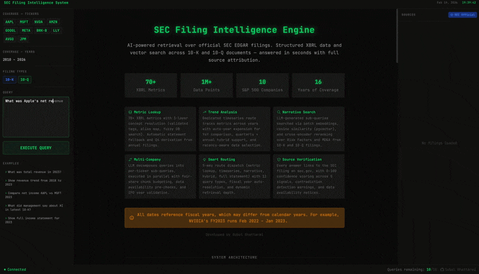
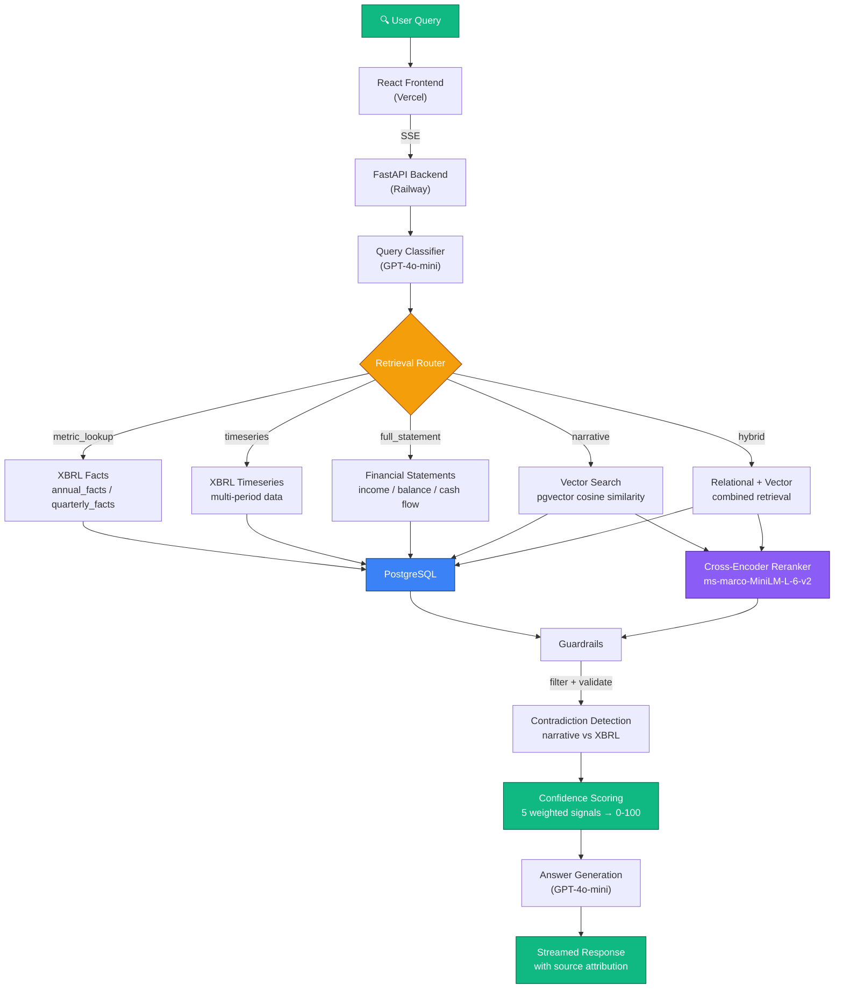
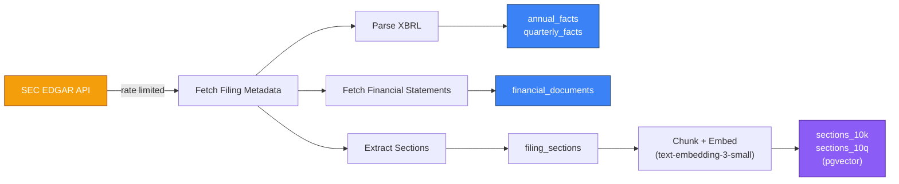

# SEC Filing Intelligence Engine

> **Query SEC filings in plain English.** Structured XBRL data + vector search over filing narratives — answers in seconds, not hours.

**Live Demo:** [sec-intelligence-system.vercel.app](https://sec-intelligence-system.vercel.app) · **GitHub:** [source code](https://github.com/bhattaraisubal-eng/sec-intelligence-system)



## Why I Built This

### The problem

Compare revenue of AAPL vs MSFT 2023 and what contributed the most to revenue generation for each companies.
Sounds simple, right?
Now let’s see what it actually takes.
🔎 If You Do This Manually:
Step 1:
Go to SEC EDGAR.
Step 2:
Find Apple’s FY2023 10-K.
Step 3:
Scroll through 80+ pages of legal text.
Step 4:
Locate the Consolidated Statements of Operations.
Step 5:
Extract total revenue.
Step 6:
Scroll further to find “Revenue by Segment” footnotes.
Step 7:
Identify which segment contributed the most (iPhone? Services?).
Now repeat the entire process for Microsoft:
Find Microsoft FY2023 10-K
Extract total revenue
Locate segment reporting
Compare Intelligent Cloud vs Productivity vs Personal Computing
Normalize fiscal year differences (Apple ends Sept, Microsoft ends June)
Cross-check management commentary in MD&A
Make sure numbers tie to XBRL
That’s easily 30–60 minutes.
For one question.


### The core insight

SEC filings contain **two fundamentally different types of information**:

| Type | Examples | Right retrieval method |
|------|----------|----------------------|
| **Structured data** | Revenue, net income, EPS, total assets | Relational DB queries over parsed XBRL facts |
| **Unstructured narrative** | Risk Factors, MD&A, Business descriptions | Vector similarity search + reranking |

Answering real analyst questions often requires **both simultaneously** — and each needs a completely different retrieval strategy. One-size-fits-all RAG doesn't work here.

### What this engine does differently

- **Structured data first** — Financial metrics come from XBRL facts via indexed relational queries, not from extracting numbers out of prose
- **Vector search only where it belongs** — Narrative questions use pgvector embeddings + cross-encoder reranking across 134K+ filing chunks; precise metrics never touch the embedding pipeline
- **Domain complexity handled, not hidden**
  - NVIDIA's fiscal year ends in January (FY2024 = Feb 2023–Jan 2024)
  - XBRL concept tags get renamed across years (`us-gaap:Revenues` → `us-gaap:RevenueFromContractWithCustomerExcludingAssessedTax`)
  - Q4 data doesn't exist in SEC filings — derived by subtracting Q1–Q3 from the annual total
- **Trust built in, not bolted on**
  - 0–100 confidence score from 5 weighted signals
  - Direct source links to the filing on sec.gov
  - Contradiction detection: flags when narrative claims conflict with actual XBRL numbers
- **5 specialized retrieval routes** — The engine classifies each query and routes to the right pipeline (metric lookup, timeseries, full statement, narrative search, or hybrid)

## Architecture



### Data Ingestion Pipeline



For detailed documentation, see:
- [Key Decisions & Challenges](docs/decisions-and-challenges.md) - Engineering trade-offs, domain complexities, deployment, and lessons learned
- [System Architecture](docs/architecture.md) - Component design, data flow, caching, guardrails
- [Database Design](docs/database.md) - Table schemas, indexes, vector search, data volumes
- [Retrieval Routes](docs/retrieval-routes.md) - How each query route works with examples

## Features

- **Intelligent Query Routing** - Classifies queries and routes to the optimal retrieval strategy
- **5 Retrieval Pipelines** - Metric lookup, timeseries, full statements, narrative search, and hybrid
- **Semantic Search** - Vector similarity search over 10-K/10-Q sections using pgvector embeddings
- **XBRL Data Extraction** - Structured financial data from SEC EDGAR XBRL filings
- **Confidence Scoring** - Investor-grade confidence tiers with signal breakdown
- **Contradiction Detection** - Identifies conflicting data across sources
- **Source Attribution** - Every answer links back to SEC EDGAR filings
- **Streaming UI** - Real-time classification, retrieval plan, and answer streaming via SSE
- **Redis Caching** - Three-layer cache (query results, classifications, retrievals)
- **Cost Tracking** - Per-query OpenAI token usage and cost estimates

## Tech Stack

| Layer | Technology |
|-------|-----------|
| Frontend | React, Tailwind CSS |
| Backend | FastAPI, Python |
| Database | PostgreSQL + pgvector |
| Embeddings | OpenAI `text-embedding-3-small` (1536 dims) |
| Reranking | `cross-encoder/ms-marco-MiniLM-L-6-v2` |
| LLM | GPT-4o-mini |
| Data Source | SEC EDGAR (XBRL + full filings) |

## Coverage

**Tickers:** AAPL, MSFT, NVDA, AMZN, GOOGL, META, BRK-B, LLY, AVGO, JPM

**Filings:** 10-K (annual) and 10-Q (quarterly) from 2010 to present

## Project Structure

```
sec_rag_system/
├── api_server.py              # FastAPI server (SSE streaming + REST)
├── rag_query.py               # Query engine: classifier, router, retrieval, generation
├── config.py                  # Tickers, years, fiscal year mappings
├── guardrails.py              # Retrieval filtering + confidence scoring
├── guardrails.yaml            # Guardrail thresholds and config
├── cache.py                   # Redis caching layer
├── chunk_and_embed.py         # Section chunking + OpenAI embeddings
├── xbrl_to_postgres.py        # XBRL parsing + PostgreSQL storage
├── fetch_financials_to_postgres.py  # Financial statement fetching
├── filing_sections.py         # 10-K/10-Q section extraction
├── section_vector_tables.py   # pgvector table setup
├── backfill_pipeline.py       # Unified data ingestion pipeline
├── requirements.txt           # Python dependencies
├── railway.toml               # Railway deployment config
├── Procfile                   # Process start command
└── frontend/                  # React frontend
    └── src/
        └── App.js             # Main UI with streaming, charts, confidence display
```

## Local Development

### Prerequisites

- Python 3.11+
- PostgreSQL 17 with pgvector extension
- Node.js 18+
- Redis (optional, for caching)

### Setup

```bash
# Clone
git clone https://github.com/bhattaraisubal-eng/sec-intelligence-system.git
cd sec-intelligence-system

# Backend
python -m venv .venv
source .venv/bin/activate
pip install -r requirements.txt

# Create .env
cat > .env << 'EOF'
OPENAI_API_KEY=sk-...
PG_HOST=localhost
PG_PORT=5432
PG_USER=your_user
PG_PASSWORD=your_password
PG_DATABASE=sec_filings
EMBEDDING_MODEL=text-embedding-3-small
EMBEDDING_DIMENSION=1536
EOF

# Start backend
uvicorn api_server:app --host 0.0.0.0 --port 8000

# Frontend (separate terminal)
cd frontend
npm install
npm start
```

### Data Ingestion

```bash
# Run the backfill pipeline to populate the database
python backfill_pipeline.py
```

## Deployment

Deployed on **Railway** (backend + PostgreSQL) and **Vercel** (frontend).

| Component | Service |
|-----------|---------|
| Frontend | [Vercel](https://vercel.com) (free) |
| Backend | [Railway](https://railway.app) ($5/mo Hobby) |
| Database | Railway PostgreSQL (pgvector Docker image) |

### Environment Variables (Railway)

| Variable | Description |
|----------|-------------|
| `DATABASE_URL` | PostgreSQL connection string (auto-parsed into PG_* vars) |
| `OPENAI_API_KEY` | OpenAI API key |
| `FRONTEND_URL` | Vercel frontend URL (for CORS) |
| `EMBEDDING_MODEL` | `text-embedding-3-small` |
| `EMBEDDING_DIMENSION` | `1536` |

### Environment Variables (Vercel)

| Variable | Description |
|----------|-------------|
| `REACT_APP_BACKEND_URL` | Railway backend URL |

## API Endpoints

| Method | Endpoint | Description |
|--------|----------|-------------|
| POST | `/query/stream` | SSE streaming query (classification + plan + result) |
| POST | `/query` | Non-streaming query |
| GET | `/health` | Health check |
| GET | `/cache/stats` | Redis cache statistics |
| POST | `/cache/clear` | Clear cache (optional `layer` param) |

## Example Queries

- "What was Apple's revenue in 2023?"
- "Compare NVIDIA and AMD gross margins from 2020 to 2024"
- "What are the key risk factors in Meta's latest 10-K?"
- "Show me JPMorgan's balance sheet for Q2 2024"
- "How has Microsoft's R&D spending changed over time?"
