# SEC Filing Intelligence Engine

A financial data retrieval engine that lets you query SEC filings (10-K, 10-Q) in natural language. Under the hood, it combines relational database queries over structured XBRL data with vector search over filing narratives — powered by retrieval-augmented generation (RAG). Covers the top 10 S&P 500 companies from 2010 to present.

**Live Demo:** [sec-intelligence-system.vercel.app](https://sec-intelligence-system.vercel.app)


## Why I Built This

Financial analysts spend hours on tasks that should take seconds.

Need Apple's Q3 revenue? You open SEC EDGAR, find the right 10-Q, download the filing, scroll through 80+ pages of legal boilerplate to find the income statement, then manually note the number. Want to compare it year-over-year? Repeat for last year's filing. Want to check if management's narrative about "strong growth" actually matches the numbers? Now you're cross-referencing MD&A commentary against XBRL data — a process that's tedious, error-prone, and completely unscalable.

The core problem is that SEC filings contain two fundamentally different types of information — **structured financial data** (XBRL-tagged numbers: revenue, net income, EPS) and **unstructured narrative text** (Risk Factors, MD&A, Business descriptions) — and answering real questions often requires both simultaneously. Existing tools handle one or the other. Bloomberg gives you the numbers but not the narrative context. ChatGPT can summarize text but hallucinates financial figures.

I wanted to build a system that solves this end-to-end:

- **Structured data first** — Revenue and net income come from XBRL facts via relational database queries with indexed lookups, not from extracting numbers out of prose. This is how financial data should be retrieved: directly from the machine-readable source the SEC requires companies to file.
- **Vector search only where it belongs** — Narrative questions like "What are Apple's key risks?" use pgvector embeddings with cross-encoder reranking to find relevant passages across 134K+ filing section chunks. Semantic search is powerful for open-ended questions, but it's the wrong tool for precise financial metrics.
- **Domain complexity handled, not hidden** — NVIDIA's fiscal year ends in January (FY2024 = Feb 2023–Jan 2024). XBRL concept tags get renamed across filing years (`us-gaap:Revenues` vs `us-gaap:RevenueFromContractWithCustomerExcludingAssessedTax`). Q4 data doesn't exist in SEC filings — it has to be derived by subtracting Q1–Q3 from the annual total. These aren't edge cases; they're the everyday reality of working with financial data, and getting them wrong means giving analysts wrong numbers.
- **Trust built in, not bolted on** — Every answer includes a 0–100 confidence score computed from 5 weighted signals, direct links to the source filing on sec.gov, and contradiction detection that flags when a management narrative ("revenue grew significantly") conflicts with the actual XBRL data (revenue declined 2.8%). Analysts need to verify. The system makes verification immediate.
- **Intelligent routing, not one-size-fits-all** — "What was Apple's revenue?" and "What are Apple's risk factors?" are fundamentally different questions that need different retrieval strategies. The engine classifies each query and routes it through one of 5 specialized pipelines — because a relational database lookup is the right tool for a metric, and vector similarity search is the right tool for a narrative.

## Architecture

```mermaid
graph TD
    A["🔍 User Query"] --> B["React Frontend<br/>(Vercel)"]
    B -->|SSE| C["FastAPI Backend<br/>(Railway)"]
    C --> D["Query Classifier<br/>(GPT-4o-mini)"]
    D --> E{Retrieval Router}

    E -->|"metric_lookup"| F["XBRL Facts<br/>annual_facts / quarterly_facts"]
    E -->|"timeseries"| G["XBRL Timeseries<br/>multi-period data"]
    E -->|"full_statement"| H["Financial Statements<br/>income / balance / cash flow"]
    E -->|"narrative"| I["Vector Search<br/>pgvector cosine similarity"]
    E -->|"hybrid"| J["Relational + Vector<br/>combined retrieval"]

    F --> K["PostgreSQL"]
    G --> K
    H --> K
    I --> K
    J --> K

    I --> L["Cross-Encoder Reranker<br/>ms-marco-MiniLM-L-6-v2"]
    J --> L

    K --> M["Guardrails"]
    L --> M

    M -->|"filter + validate"| N["Contradiction Detection<br/>narrative vs XBRL"]
    N --> O["Confidence Scoring<br/>5 weighted signals → 0-100"]
    O --> P["Answer Generation<br/>(GPT-4o-mini)"]
    P --> Q["Streamed Response<br/>with source attribution"]

    style A fill:#10b981,stroke:#065f46,color:#fff
    style E fill:#f59e0b,stroke:#92400e,color:#fff
    style K fill:#3b82f6,stroke:#1e3a5f,color:#fff
    style L fill:#8b5cf6,stroke:#4c1d95,color:#fff
    style O fill:#10b981,stroke:#065f46,color:#fff
    style Q fill:#10b981,stroke:#065f46,color:#fff
```



### Data Ingestion Pipeline


For detailed documentation, see:
- [Key Decisions & Challenges](docs/decisions-and-challenges.md) - Engineering trade-offs, domain complexities, deployment, and lessons learned
- [System Architecture](docs/architecture.md) - Component design, data flow, caching, guardrails
- [Database Design](docs/database.md) - Table schemas, indexes, vector search, data volumes
- [Retrieval Routes](docs/retrieval-routes.md) - How each query route works with examples

## Features

- **Intelligent Query Routing** - Classifies queries and routes to the optimal retrieval strategy
- **5 Retrieval Pipelines** - Metric lookup, timeseries, full statements, narrative search, and hybrid
- **Semantic Search** - Vector similarity search over 10-K/10-Q sections using pgvector embeddings
- **XBRL Data Extraction** - Structured financial data from SEC EDGAR XBRL filings
- **Confidence Scoring** - Investor-grade confidence tiers with signal breakdown
- **Contradiction Detection** - Identifies conflicting data across sources
- **Source Attribution** - Every answer links back to SEC EDGAR filings
- **Streaming UI** - Real-time classification, retrieval plan, and answer streaming via SSE
- **Redis Caching** - Three-layer cache (query results, classifications, retrievals)
- **Cost Tracking** - Per-query OpenAI token usage and cost estimates

## Tech Stack

| Layer | Technology |
|-------|-----------|
| Frontend | React, Tailwind CSS |
| Backend | FastAPI, Python |
| Database | PostgreSQL + pgvector |
| Embeddings | OpenAI `text-embedding-3-small` (1536 dims) |
| Reranking | `cross-encoder/ms-marco-MiniLM-L-6-v2` |
| LLM | GPT-4o-mini |
| Data Source | SEC EDGAR (XBRL + full filings) |

## Coverage

**Tickers:** AAPL, MSFT, NVDA, AMZN, GOOGL, META, BRK-B, LLY, AVGO, JPM

**Filings:** 10-K (annual) and 10-Q (quarterly) from 2010 to present

## Project Structure

```
sec_rag_system/
├── api_server.py              # FastAPI server (SSE streaming + REST)
├── rag_query.py               # Query engine: classifier, router, retrieval, generation
├── config.py                  # Tickers, years, fiscal year mappings
├── guardrails.py              # Retrieval filtering + confidence scoring
├── guardrails.yaml            # Guardrail thresholds and config
├── cache.py                   # Redis caching layer
├── chunk_and_embed.py         # Section chunking + OpenAI embeddings
├── xbrl_to_postgres.py        # XBRL parsing + PostgreSQL storage
├── fetch_financials_to_postgres.py  # Financial statement fetching
├── filing_sections.py         # 10-K/10-Q section extraction
├── section_vector_tables.py   # pgvector table setup
├── backfill_pipeline.py       # Unified data ingestion pipeline
├── requirements.txt           # Python dependencies
├── railway.toml               # Railway deployment config
├── Procfile                   # Process start command
└── frontend/                  # React frontend
    └── src/
        └── App.js             # Main UI with streaming, charts, confidence display
```

## Local Development

### Prerequisites

- Python 3.11+
- PostgreSQL 17 with pgvector extension
- Node.js 18+
- Redis (optional, for caching)

### Setup

```bash
# Clone
git clone https://github.com/bhattaraisubal-eng/sec-intelligence-system.git
cd sec-intelligence-system

# Backend
python -m venv .venv
source .venv/bin/activate
pip install -r requirements.txt

# Create .env
cat > .env << 'EOF'
OPENAI_API_KEY=sk-...
PG_HOST=localhost
PG_PORT=5432
PG_USER=your_user
PG_PASSWORD=your_password
PG_DATABASE=sec_filings
EMBEDDING_MODEL=text-embedding-3-small
EMBEDDING_DIMENSION=1536
EOF

# Start backend
uvicorn api_server:app --host 0.0.0.0 --port 8000

# Frontend (separate terminal)
cd frontend
npm install
npm start
```

### Data Ingestion

```bash
# Run the backfill pipeline to populate the database
python backfill_pipeline.py
```

## Deployment

Deployed on **Railway** (backend + PostgreSQL) and **Vercel** (frontend).

| Component | Service |
|-----------|---------|
| Frontend | [Vercel](https://vercel.com) (free) |
| Backend | [Railway](https://railway.app) ($5/mo Hobby) |
| Database | Railway PostgreSQL (pgvector Docker image) |

### Environment Variables (Railway)

| Variable | Description |
|----------|-------------|
| `DATABASE_URL` | PostgreSQL connection string (auto-parsed into PG_* vars) |
| `OPENAI_API_KEY` | OpenAI API key |
| `FRONTEND_URL` | Vercel frontend URL (for CORS) |
| `EMBEDDING_MODEL` | `text-embedding-3-small` |
| `EMBEDDING_DIMENSION` | `1536` |

### Environment Variables (Vercel)

| Variable | Description |
|----------|-------------|
| `REACT_APP_BACKEND_URL` | Railway backend URL |

## API Endpoints

| Method | Endpoint | Description |
|--------|----------|-------------|
| POST | `/query/stream` | SSE streaming query (classification + plan + result) |
| POST | `/query` | Non-streaming query |
| GET | `/health` | Health check |
| GET | `/cache/stats` | Redis cache statistics |
| POST | `/cache/clear` | Clear cache (optional `layer` param) |

## Example Queries

- "What was Apple's revenue in 2023?"
- "Compare NVIDIA and AMD gross margins from 2020 to 2024"
- "What are the key risk factors in Meta's latest 10-K?"
- "Show me JPMorgan's balance sheet for Q2 2024"
- "How has Microsoft's R&D spending changed over time?"
