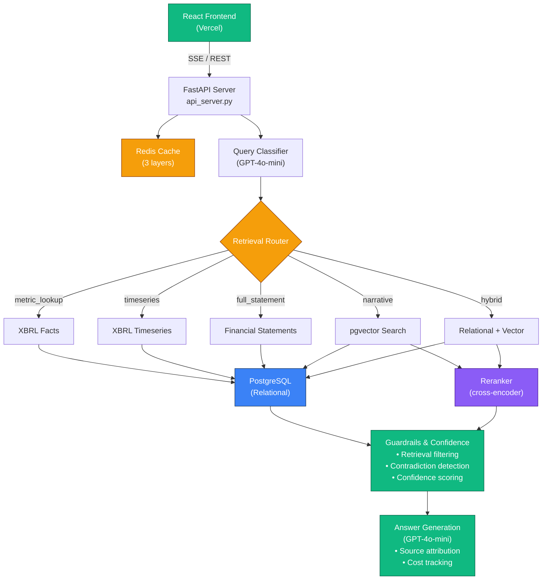
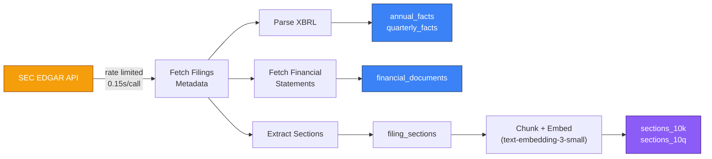

# System Architecture

## Overview

The SEC RAG System is a retrieval-augmented generation pipeline that answers natural language questions about SEC filings. It combines structured XBRL data, full financial statements, and semantic vector search over filing narratives.

## High-Level Data Flow



## Component Details

### Frontend (`frontend/src/App.js`)

- **Framework**: React with Tailwind CSS
- **Communication**: Server-Sent Events (SSE) for streaming responses
- **Features**: Real-time classification display, retrieval plan animation, confidence breakdown, source links to SEC EDGAR, cost tracking

### API Server (`api_server.py`)

- **Framework**: FastAPI
- **Endpoints**:
  - `POST /query/stream` - SSE streaming (classification -> retrieval plan -> result)
  - `POST /query` - Non-streaming (backwards compatible)
  - `GET /health` - Health check
  - `GET /cache/stats` - Cache statistics
  - `POST /cache/clear` - Clear cache by layer
- **CORS**: Configured via `FRONTEND_URL` env var
- **DATABASE_URL**: Auto-parsed into individual `PG_*` env vars for Railway compatibility

### Query Engine (`rag_query.py`)

The core pipeline has 4 stages:

**Stage 1: Classification** (`classify_query()`)
- Uses GPT-4o-mini with function calling to extract query metadata
- Determines: route, ticker(s), fiscal year/quarter, XBRL concepts, retrieval intent
- Results cached for 2 hours

**Stage 2: Retrieval** (5 route-specific retrievers)
- Each route fetches data from different sources (see [Retrieval Routes](retrieval-routes.md))
- Results cached for 1 hour

**Stage 3: Guardrails** (`guardrails.py`)
- Filters low-quality retrieval results
- Detects contradictions between narrative claims and XBRL data
- Computes confidence score (0-100) with 5 weighted signals

**Stage 4: Answer Generation**
- GPT-4o-mini synthesizes answer from filtered context
- Includes source attribution and confidence tier
- Token usage and cost tracked per query

### Caching (`cache.py`)

Three-layer Redis cache with graceful degradation (works without Redis):

| Layer | Key | TTL | Contents |
|-------|-----|-----|----------|
| Query Results | `sec_rag:v3:query:<hash>` | 1h | Full `rag_query()` output |
| Classification | `sec_rag:v3:classify:<hash>` | 2h | `classify_query()` output |
| Retrieval | `sec_rag:v3:retrieval:<hash>` | 1h | Route-specific retrieval data |

### Guardrails (`guardrails.py` + `guardrails.yaml`)

All thresholds, weights, and keywords are config-driven via `guardrails.yaml`. No hardcoded logic.

**Retrieval Filtering**:
- Vector: min similarity (0.6), min rerank score (-1.0), max chunks (50)
- Relational: max 5 facts per concept
- Multi-ticker: fair per-ticker allocation

**Contradiction Detection**:
- Compares narrative directional claims ("revenue increased") against XBRL YoY changes
- Detects direction mismatches and magnitude discrepancies
- Severity: high (>10% gap) or medium

**Confidence Scoring** (5 signals):

| Signal | Weight | Description |
|--------|--------|-------------|
| Retrieval Quality | 25-40% | Source reliability (XBRL=90, statements=72, narrative=varies) |
| Source Coverage | 20-25% | How many requested dimensions were covered |
| Cross-Source Agreement | 15-20% | Contradiction penalties (-25 per high, -15 per medium) |
| Citation Density | 10-15% | Citations per sentence vs target (0.5) |
| Data Recency | 10-15% | Staleness penalty (-20 per year gap) |

**Tiers**: High (85+, green), Medium (60-84, yellow), Low (0-59, red)

### Database Connection Pattern

All modules use the same lazy singleton pattern:

```python
_connection_pool = None

def get_connection_pool():
    global _connection_pool
    if _connection_pool is None:
        _connection_pool = pool.ThreadedConnectionPool(
            minconn=1, maxconn=10,
            host=os.getenv("PG_HOST", "localhost"),
            port=os.getenv("PG_PORT", "5432"),
            user=os.getenv("PG_USER"),
            password=os.getenv("PG_PASSWORD"),
            database=os.getenv("PG_DATABASE")
        )
    return _connection_pool
```

## Data Ingestion Pipeline

The `backfill_pipeline.py` orchestrates the full ingestion:



Rate limited at 0.15s between SEC EDGAR API calls.
