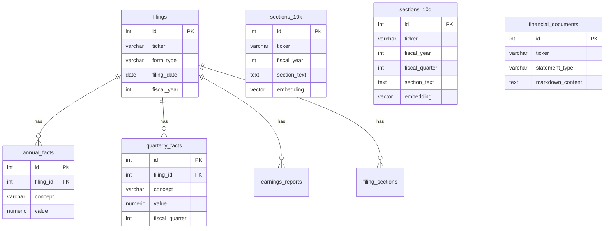

# Database Design

## Overview

PostgreSQL 17 with the pgvector extension. All tables live in the `public` schema of the `sec_filings` database (or `railway` in production).

## Entity-Relationship Diagram



## Tables

### `filings`

Central metadata table for all SEC filings.

| Column | Type | Description |
|--------|------|-------------|
| id | SERIAL PK | |
| ticker | VARCHAR(10) | Company ticker symbol |
| company_name | VARCHAR(255) | |
| form_type | VARCHAR(20) | 10-K, 10-Q|
| filing_date | DATE | Date filed with SEC |
| accession_number | VARCHAR(50) UNIQUE | SEC EDGAR accession number |
| fiscal_year | INT | |
| fiscal_period | VARCHAR(10) | FY, Q1, Q2, Q3, Q4 |
| created_at | TIMESTAMP | |

**Indexes**: `idx_filings_ticker(ticker)`, `idx_filings_form_date(form_type, filing_date DESC)`

### `annual_facts`

XBRL facts from 10-K filings (one row per concept per year).

| Column | Type | Description |
|--------|------|-------------|
| id | SERIAL PK | |
| filing_id | INT FK -> filings | |
| ticker | VARCHAR(10) | |
| fiscal_year | INT | |
| concept | VARCHAR(255) | XBRL concept (e.g., `us-gaap:Revenues`) |
| value | NUMERIC | Parsed numeric value |
| unit | VARCHAR(50) | USD, shares, etc. |
| start_date | DATE | Period start (duration concepts) |
| end_date | DATE | Period end (duration concepts) |
| instant_date | DATE | Point-in-time (instant concepts) |
| decimals | INT | Precision |
| raw_value | TEXT | Original string value |
| dimension | VARCHAR(255) | XBRL dimension (NULL = consolidated) |
| member | VARCHAR(255) | XBRL dimension member |
| created_at | TIMESTAMP | |

**Indexes**:
- `idx_annual_ticker_year(ticker, fiscal_year)`
- `idx_annual_concept_hash USING hash(concept)`
- `idx_annual_rag(ticker, concept, fiscal_year) INCLUDE (value, unit)`
- `idx_annual_consolidated(ticker, concept, fiscal_year) INCLUDE (value, unit) WHERE dimension IS NULL`

### `quarterly_facts`

XBRL facts from 10-Q filings. Same schema as `annual_facts` plus `fiscal_quarter INT`.

**Indexes**: Same pattern as annual, with `fiscal_quarter` added to composite indexes.

### `filing_sections`

Extracted sections from 10-K and 10-Q filings (plain text, no embeddings).

| Column | Type | Description |
|--------|------|-------------|
| id | SERIAL PK | |
| filing_id | INT FK -> filings | |
| ticker | VARCHAR(10) | |
| form_type | VARCHAR(20) | |
| fiscal_year | INT | |
| fiscal_period | VARCHAR(10) | |
| section_key | VARCHAR(200) | e.g., `item_1a_risk_factors` |
| section_title | VARCHAR(300) | |
| section_text | TEXT | Full section content |
| char_count | INT | |
| word_count | INT | |
| file_path | VARCHAR(500) | |
| created_at | TIMESTAMP | |

### `sections_10k`

10-K filing sections chunked with pgvector embeddings for semantic search.

| Column | Type | Description |
|--------|------|-------------|
| id | SERIAL PK | |
| ticker | VARCHAR(10) | |
| cik | VARCHAR(20) | SEC CIK number |
| company_name | VARCHAR(255) | |
| accession_number | VARCHAR(30) | |
| filing_date | DATE | |
| fiscal_year | INT | |
| fiscal_period | VARCHAR(10) | Default 'FY' |
| section_id | VARCHAR(50) | e.g., `item_1a_risk_factors` |
| section_title | VARCHAR(100) | |
| part_number | VARCHAR(5) | |
| item_number | VARCHAR(5) | |
| section_description | TEXT | |
| section_text | TEXT | Chunk text content |
| char_count | INT | |
| word_count | INT | |
| **embedding** | **vector(1536)** | OpenAI text-embedding-3-small |
| is_chunked | BOOLEAN | FALSE = full section, TRUE = chunk |
| parent_section_id | INT FK -> sections_10k | Links chunk to parent |
| chunk_index | INT | Position within parent section |
| chunk_start_char | INT | |
| chunk_end_char | INT | |
| subsection_heading | TEXT | |
| subsection_index | INT | |
| subsection_start_char | INT | |
| subsection_end_char | INT | |
| source_file_path | VARCHAR(500) | |
| created_at | TIMESTAMP | |
| updated_at | TIMESTAMP | |

**Unique constraint**: `(ticker, fiscal_year, section_id, chunk_index)`

**Indexes**:
- `idx_10k_ticker_year(ticker, fiscal_year)` - Primary lookup
- `idx_10k_section(section_id)` - Filter by section type
- `idx_10k_embedding USING ivfflat (embedding vector_cosine_ops) WITH (lists=50)` - Vector similarity search
- `idx_10k_text_search USING gin(to_tsvector('english', section_text))` - Full-text search

### `sections_10q`

Same schema as `sections_10k` plus `fiscal_quarter INT`.

**Unique constraint**: `(ticker, fiscal_year, fiscal_quarter, section_id, chunk_index)`

### `financial_documents`

Complete financial statements stored as markdown text.

| Column | Type | Description |
|--------|------|-------------|
| id | SERIAL PK | |
| ticker | VARCHAR(10) | |
| form_type | VARCHAR(10) | 10-K, 10-Q |
| statement_type | VARCHAR(50) | income_statement, balance_sheet, cash_flow |
| fiscal_year | INT | |
| fiscal_quarter | INT | NULL for annual |
| markdown_content | TEXT | Full statement in markdown table format |
| created_at | TIMESTAMP | |

**Unique constraint**: `(ticker, form_type, statement_type, fiscal_year, fiscal_quarter)`

**Index**: `idx_fd_lookup(ticker, statement_type, fiscal_year, fiscal_quarter)`

## Vector Search

Semantic search uses pgvector's IVFFlat index with cosine distance:

```sql
SELECT id, section_text, 1 - (embedding <=> $1) AS similarity
FROM sections_10k
WHERE ticker = $2 AND fiscal_year = $3 AND is_chunked = TRUE
ORDER BY embedding <=> $1
LIMIT $4;
```

- **Embedding model**: OpenAI `text-embedding-3-small` (1536 dimensions)
- **Distance metric**: Cosine similarity (`<=>` operator)
- **Index type**: IVFFlat with 50 lists (reduced from 100 for Railway memory limits)
- **Reranking**: Results are reranked using `cross-encoder/ms-marco-MiniLM-L-6-v2`

## Data Volume (Production)

| Table | Row Count | Description |
|-------|-----------|-------------|
| quarterly_facts | ~734K | XBRL quarterly data points |
| annual_facts | ~361K | XBRL annual data points |
| sections_10q | ~92K | 10-Q chunks with embeddings |
| sections_10k | ~42K | 10-K chunks with embeddings |
| financial_documents | ~1.8K | Markdown financial statements |
| filings | ~637 | Filing metadata |
| filing_sections | ~279 | Raw section extractions |

**Total database size**: ~3 GB
