# Retrieval Routes

The query engine classifies each incoming question and routes it to one of 5 specialized retrieval pipelines.

## Route Selection

The classifier (GPT-4o-mini with function calling) selects a route based on:

| Signal | Example |
|--------|---------|
| Query type | "What was revenue?" -> factual, "Compare X vs Y" -> comparative |
| Retrieval intent | specific_metric, timeseries, full_statement |
| Temporal granularity | annual vs quarterly |
| Number of tickers | single vs multi-company |

## Route 1: `metric_lookup`

**Purpose**: Retrieve specific XBRL financial metrics with year-over-year comparisons.

**When used**: "What was Apple's revenue in 2023?", "MSFT net income 2024"

**Pipeline**:
```
1. Extract ticker(s), year(s), XBRL concepts from classification
2. Query annual_facts or quarterly_facts table
   - Filter: dimension IS NULL (consolidated totals only)
   - Match by ticker, fiscal_year, concept
3. Compute YoY comparisons (delta + pct_change)
4. Fallback: fetch full statement via get_statement() if XBRL returns no data
5. Return {xbrl_facts, comparisons, statements}
```

**Data sources**: `annual_facts`, `quarterly_facts`, `financial_documents`

**Confidence**: High (XBRL score = 90, statement fallback = 72)

## Route 2: `timeseries`

**Purpose**: Fetch a metric across multiple time periods for trend analysis.

**When used**: "Show AAPL revenue from 2020 to 2024", "JPM net income trend"

**Pipeline**:
```
1. Map user concepts to XBRL concept aliases
   - "revenue" -> [us-gaap:Revenues, us-gaap:RevenueFromContractWithCustomer, ...]
   - Handles concept renames across filing years
2. Fetch timeseries via get_metric_timeseries()
   - Returns all matching data points across years
3. Derive Q4 values: Annual - Q1 - Q2 - Q3
4. Sort chronologically
5. Return {timeseries[], xbrl_facts, comparisons}
```

**Data sources**: `annual_facts`, `quarterly_facts`

**Confidence**: Scored by data point coverage (points found / years requested)

## Route 3: `full_statement`

**Purpose**: Retrieve complete financial statements in markdown format.

**When used**: "Apple's 2024 balance sheet", "Show me NVDA income statement Q2 2024"

**Pipeline**:
```
1. Determine statement types needed (income_statement, balance_sheet, cash_flow)
2. Fetch from financial_documents table
   - Match by ticker, statement_type, fiscal_year, fiscal_quarter
3. For Q4: calculate as (Annual statement - Q1 - Q2 - Q3) if Q4 not filed separately
4. Return {statements[], xbrl_facts}
```

**Data sources**: `financial_documents`

**Confidence**: High (authoritative structured data)

## Route 4: `narrative`

**Purpose**: Semantic search over 10-K and 10-Q filing sections (MD&A, Risk Factors, Business).

**When used**: "What are Apple's main risks?", "Describe Microsoft's AI strategy", "What did management say about margins?"

**Pipeline**:
```
1. Generate query embedding (text-embedding-3-small, 1536 dims)
2. For each (ticker, year) pair:
   a. Search sections_10k using pgvector cosine similarity
   b. Search sections_10q using pgvector cosine similarity
   c. Filter by is_chunked = TRUE
   d. Retrieve top N candidates (initial_candidates, default ~100)
3. Rerank all candidates using cross-encoder/ms-marco-MiniLM-L-6-v2
4. Apply guardrails:
   - Min similarity threshold (0.6)
   - Min rerank score (-1.0)
   - Max chunks (50)
   - Multi-ticker: fair per-ticker allocation
5. Deduplicate and sort by rerank score
6. Return list[{text, similarity, rerank_score, section metadata}]
```

**Data sources**: `sections_10k`, `sections_10q`

**Confidence**: Based on average rerank scores + section diversity bonus + chunk count bonus

## Route 5: `hybrid`

**Purpose**: Combines structured relational data with narrative context for complex queries.

**When used**: "Which is more profitable, AAPL or MSFT?", "Compare revenue growth and explain drivers"

**Pipeline**:
```
1. Route relational component based on retrieval_intent:
   - "timeseries"       -> retrieve_timeseries()
   - "full_statement"   -> retrieve_full_statement()
   - "specific_metric"  -> retrieve_metric_lookup()
2. Fetch narrative component:
   - retrieve_narrative() for relevant section chunks
3. Merge results
4. Apply guardrails to both components
5. Return {relational: {...}, vector: [...]}
```

**Data sources**: All tables

**Confidence**: Weighted combination of relational and narrative scores

## Post-Retrieval Pipeline

After retrieval, all routes pass through the same pipeline:

### 1. Guardrail Filtering (`guardrails.py`)
- Remove low-quality chunks below similarity/rerank thresholds
- Trim excess facts per concept (max 5)
- Warn if context is empty after filtering

### 2. Contradiction Detection
- Compare narrative directional claims against XBRL YoY data
- Flag direction mismatches (narrative says "increased" but data shows decrease)
- Flag magnitude discrepancies (narrative claims ~20% but data shows 5%)

### 3. Context Formatting
- Relational data: formatted as structured text with labels
- Narrative chunks: joined with section headers and source attribution
- Hybrid: both sections combined with clear separation

### 4. Answer Generation (GPT-4o-mini)
- Temperature: 0.1 (near-deterministic)
- Max tokens: 2000
- Includes source citations in `[Source: ...]` format
- Surfaces confidence tier and any contradiction warnings

### 5. Confidence Scoring

| Signal | Weight | Method |
|--------|--------|--------|
| Retrieval Quality | 25-40% | Route-dependent (XBRL=90, narrative=rerank avg) |
| Source Coverage | 20-25% | Dimensions covered / dimensions requested |
| Cross-Source Agreement | 15-20% | Penalty per contradiction |
| Citation Density | 10-15% | Citations per sentence vs 0.5 target |
| Data Recency | 10-15% | Staleness penalty (-20/year) |

Weights vary by route type (relational routes weight retrieval quality higher).

## Example Query Flows

### "What was Apple's revenue in 2023?"


### "What are the key risk factors in Meta's latest 10-K?"

```mermaid
graph LR
    A["Classify<br/>narrative<br/>META, 2024"] --> B["Retrieve<br/>pgvector search<br/>47 chunks"]
    B --> C["Rerank<br/>cross-encoder<br/>→ top 15"]
    C --> D["Guardrails<br/>filter → 12 chunks"]
    D --> E["Generate Answer"]
    E --> F["Confidence: 78.2<br/>🟡 Medium"]

    style A fill:#f59e0b,stroke:#92400e,color:#fff
    style B fill:#8b5cf6,stroke:#4c1d95,color:#fff
    style F fill:#f59e0b,stroke:#92400e,color:#fff
```



### "Compare AAPL and MSFT revenue growth 2020-2024"


